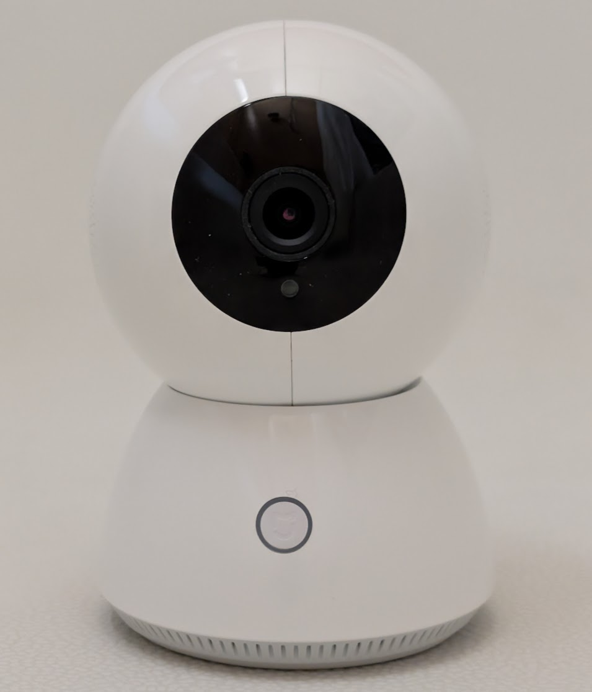
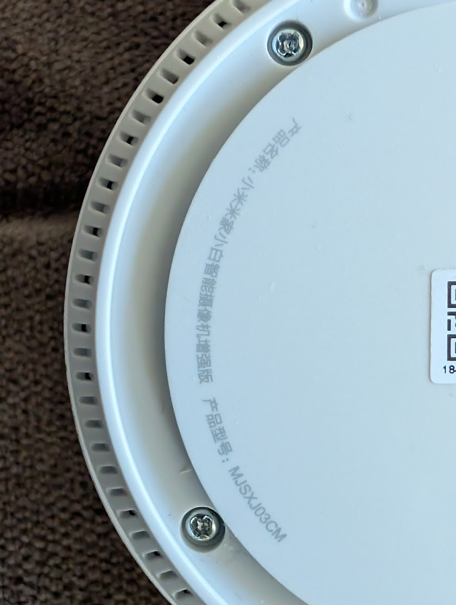

# 小米米家小白智能摄像机增强版 (MJSXJ03CM) 固件逆向与 Root 指南

  
  

本项目旨在对“小米米家小白智能摄像机增强版（型号：MJSXJ03CM）”进行安全审计、固件逆向分析以及 Root 提权研究。通过分析其内部构造与系统启动流程，探讨如何在该设备上实现本地化控制和高级功能开发（如纯本地 RTSP 视频流）。

> 适用固件版本：`3.5.8_20031301_c`
> 硬件芯片平台：安霸（Ambarella）

## ⚠️ 免责声明 (Disclaimer)
本项目及相关文档仅用于技术研究、学习交流及实现设备的合法互操作性（如接入 Home Assistant）。
1. **非官方项目**：本项目与小米公司（Xiaomi Inc.）及其子品牌（米家/Mijia）无任何隶属、赞助或授权关系。
2. **风险自负**：本项目内容涉及对硬件固件的分析与修改。执行本仓库描述的操作可能导致您的设备保修失效、功能异常、甚至完全无法启动（变砖）。用户需自行承担所有风险。
3. **法律合规**：请确保您对所操作的设备拥有合法所有权，并遵守您所在司法管辖区的相关法律法规。本项目不支持、不鼓励任何非法修改、未经授权的数据获取或其他违法行为。
4. **无担保**：作者不对本项目提供任何形式的担保，包括但不限于对适用性、准确性、安全性或完整性的保证。因使用本项目内容导致的任何直接或间接损失，作者不承担任何责任。
**如果您不同意上述条款，请立即停止使用本项目中的任何内容。**

---

## 📚 文档列表 (Documentation)

本项目包含以下两份核心研究指南，请根据需求查阅：

### 1. [Root 提权与 Telnet 后门指南](./MJSXJ03CM_1_Root指南.md)
详细介绍了如何获取该设备的最高权限：
- 设备硬件与串口（UART）基本信息
- 方式 A：通过 UART 串口注入启动参数获取 Root（推荐，最稳定）
- 方式 B：通过局域网虚假 OTA 劫持漏洞获取 Root（无需拆机）
- RTSP 视频流本地化配置方案与现状分析
- 官方 SD 卡救砖刷机指南

### 2. [固件逆向与安全审计指南](./MJSXJ03CM_2_固件逆向指南.md)
深入剖析官方固件内部结构与安全机制：
- 固件结构概览 (`tfk.bin`, `tfr.bin`)
- UBI 根文件系统解包与 nandsim 模拟挂载详细步骤（含极客向的闪存结构分析）
- 关键文件与启动链审计（密码体系、启动脚本）
- 系统服务冲突分析（米家 imiApp 与 安霸原生 rtsp_server 的资源争夺）
- 漏洞分析（OTA 升级流程设计缺陷）
- amboot 控制台限制与底层硬件架构说明

## 💡 核心发现与研究亮点
- **芯片平台更正**：网络上诸多早期资料指向此类设备使用全志安凯（Allwinner），但经固件逆向与跑码证实，本特定型号和固件批次（3.5.8）实为**安霸（Ambarella）**芯片架构。
- **本地化可行性**：通过修改启动脚本，可实现让设备脱离米家云端，运行纯本地的安霸 RTSP 流。
- **漏洞披露**：揭示了 `proc_updatepackage.sh` 脚本在处理 OTA 升级包时的权限与签名校验缺失问题，使得无拆机 Root 成为可能。

## 🛠️ 关于固件文件
为遵守知识产权与相关法律法规，**本仓库不提供、不分发任何小米/创米官方受版权保护的二进制固件文件（如 `*.bin` 文件）**。
进行研究时，您需要自行前往创米官方软件升级中心下载救砖包，或通过您自己的合法设备自行提取分析所需的文件。

## 🤝 贡献与交流
欢迎提交 Issue 或 Pull Request 分享您的研究进展！特别欢迎以下方向的讨论：
- 绕过硬件编码器占用，实现米家 App 与本地 RTSP 并存的方案。
- 为此固件移植 `v4l2rtspserver`。
- 其他持久化接入开源智能家居（如 Home Assistant）的稳定方案。
